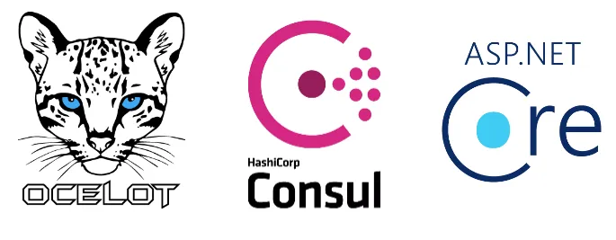
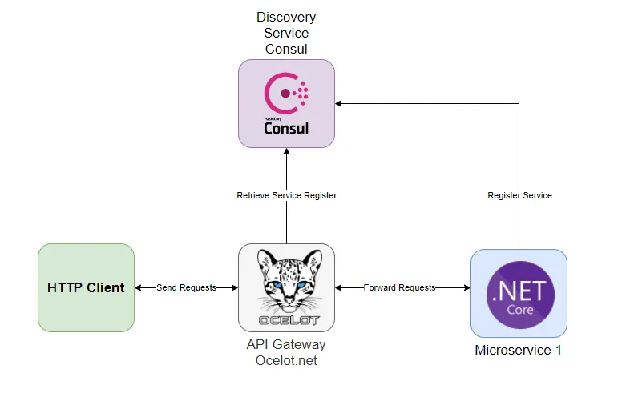
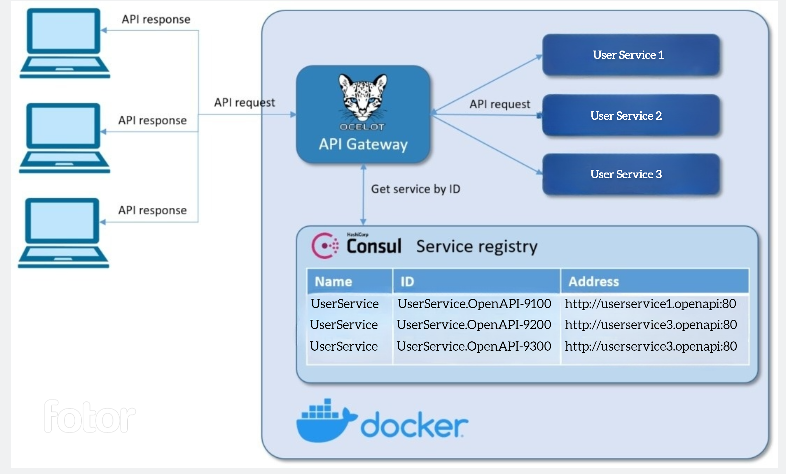

# What is Service discovery 
Service discovery is the process of automatically detecting and registering the availability and location of services within a distributed system. It is typically used in modern software architectures such as microservices and cloud-native applications, where services are often ephemeral and may be frequently created, updated, or destroyed.

Service discovery enables applications to dynamically locate and communicate with each other, without requiring manual configuration or hard-coding of network addresses. Instead, services register themselves with a central registry, which other services can query to discover the location and availability of the desired service.

One of the primary benefits of service discovery is increased flexibility and scalability. As services are added, removed, or scaled up or down, the service discovery system can dynamically update the registry, ensuring that applications can always find the services they need. This can help to reduce downtime, improve fault tolerance, and increase overall system performance.

## What is consul?

Consul is a software first released in 2014 by HashiCorp.
It is a service mesh solution that provides full featured control plane with DNS-based service discovery and distributed key-value storage, segmentation and configuration and can be used individually or together to build a full service mesh.

## Why choose Consul?

Consul is a good choice when you need to deliver an on-premises solution that doesn't require your potential customers to have existing infrastructure and a cooperative IT provider. Consul is a lightweight single executable, has no dependencies, and as such can easily be built into your middleware solution. When Consul is your solution for discovering, checking, and maintaining your microservices.

1. 'Load balancing': Service discovery can be used to balance traffic across multiple instances of a service, improving performance and resiliency.
1. 'Service composition': Services can be dynamically composed and recomposed to create new applications and workflows on the fly.
1. 'High availability': Service discovery can be used to ensure that services remain available even in the event of a failure or outage.
1. 'Scaling': Service discovery can be used to dynamically scale services up or down based on demand, without requiring manual intervention.

## Consul Vs Eureka

- Simple setup
- Health checks
- KV - note to allow sync of ocelot config when there are multiple instances
- command line application
- UI
- Better client library support and bigger use in community following 
-spring boot eureka vs GO

## Service self-registration
A key part of the tutorial is the use of the Consul to dynamically discover service endpoints. Once a service is registered with Consul, it can be discovered using typical DNS or custom API.

Consul provides health-checks on these service instances. If one of the service instances or services itself is unhealthy or fails its health-check, the registry would then know about this and would avoid returning the service’s address. The work that the load-balancer would do is handled by the registry in this case.

Because we use **multiple instances of the same service**, Consul would randomly send traffic to different instances. It thus balances the load between instances of services.

Consul handles challenges of failure detection and load distribution across multiple instances of services without the necessity of deploying a centralized load balancer.

It automatically manages the registry, which is updated when any new instance of the service is registered and becomes available to receive traffic. This helps us to easily scale the services.

Before getting into implementation details how to implement self-registration to Consul, let’s look into how service discovery with self-registration really works.

In a first step a service instance registers itself to the service discovery service by providing its name, ID and address. After this gateway is able to get address of this service by querying the Consul service discovery by its name/ID.

**The key thing to note here** is that the service instances are registered with a **unique service ID** in order to disambiguate between instances of service which are running on the same Consul service agent. It is required that all services **have a unique ID per node**, so if names might conflict (our case) then unique IDs must be provided.



## Architecture


## Creating API Gateway using Ocelot

**Ocelot** requires that you provide a configuration file that contains a list of **Routes** (configuration used to map upstream request) and a **GlobalConfiguration** (other configuration like QoS, Rate limiting, etc.).
In the ocelot.json file below, you can see how we forward HTTP requests. We have to specify which type of load balancer we will use, in our case this is a **“RoundRobin”** which loops through available services and sends requests to available services.
It is important to set the Consul as a service discovery service in **GlobalConfiguration** for **ServiceDiscoveryProvider**.
```json
{
	"Routes": [
		{
			"Servicename": "UserService",
			"DownstreamPathTemplate": "/{url}",
			"DownstreamScheme": "http",
			"UpstreamPathTemplate": "/{url}",
			"UpstreamHttpMethod": [ "GET" ],
			"UseServiceDiscovery": true,
			"RouteIsCaseSensitive": false,
			"LoadBalancerOptions": {
				"Type": "RoundRobin"
			},
			"QoSOptions": {
				"ExceptionsAllowedBeforeBreaking": 3,
				"DurationOfBreak": 5000,
				"TimeoutValue": 2000
			}
		}
	],
	"GlobalConfiguration": {
		"RequestIdKey": "OcRequestId",
		"UseServiceDiscovery": true,
		"ServiceDiscoveryProvider": {
			"Host": "consul",
			"Port": 8500,
			"Type": "PollConsul",
			"PollingInterval": 100
		}
	}
}
```
Here are some necessary explanations for **ServiceDiscoveryProvider** settings in the **GlobalConfiguration** section: 
 
* Host - the host of Consul
* Port - the port of Consul
* Type	
  * Consul, means that Ocelot will get service information from consul per request
  * PollConsul, means that Ocelot will poll Consul for latest service information
* PollingInterval - tells Ocelot how often to call Consul for changes in the service registry